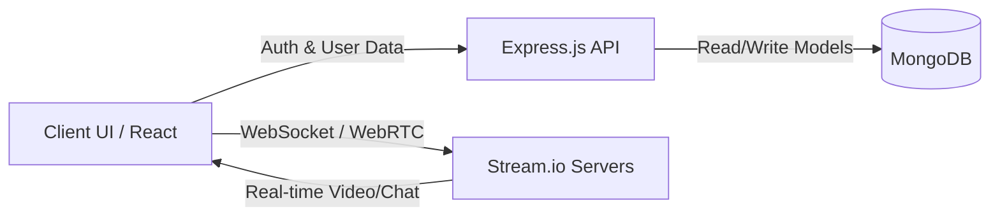

<p align="center">
  
</p>

<h1 align="center">🚀 SpeakSync</h1>

<p align="center">
  <b>Full-Stack Language Exchange Platform</b><br>
  Built with React • Node.js • Stream.io • MongoDB
</p>

<p align="center">
  
  
  
  
  
</p>

---

## 🚀 Overview

> A full-stack **language exchange platform** where users can connect, practice languages through real-time chat and HD video calls, and build meaningful connections worldwide.

Built with modern web technologies, SpeakSync showcases a robust application lifecycle and architecture, demonstrating a strong understanding of:
- Real-time WebRTC & Socket integration
- Multi-state user onboarding flows
- Secure RESTful API design

---

## 🧠 Why This Project Stands Out

| Typical Projects ❌ | This Project ✅ |
|-------------------|----------------|
| Basic text chat arrays | ✔ Real-time messaging & 1080p HD Video via Stream.io |
| Simple user models | ✔ Multi-state onboarding & goal-based matching |
| One-click follow system | ✔ 2-Tier Friend System (Pending + Accepted states) |
| Hardcoded CSS | ✔ Mobile-first UI with 32+ dynamic DaisyUI Themes |
| Monolithic routing | ✔ Strict MVC Architecture & JWT Protected Routes |

---

## ✨ Features

### 💬 Real-Time Communication
- **Instant Messaging:** Live updates and typing indicators
- **HD Video Calling:** 1080p quality with unlimited sessions
- Powered by robust **Stream.io** infrastructure

---

### 👥 User Journey & Connections
- **Language Exchange Focus:** Intelligent matching based on specific learning goals
- **Complete Onboarding:** Seamless profile and preference setup
- **Friend Management:** Comprehensive request system (send, accept, pending)

---

### 🎨 UI/UX Customization
- **Theme Engine:** Support for 32+ beautiful DaisyUI themes
- **Dynamic Avatars:** 7 unique DiceBear avatar styles (200×200px)
- **Responsive Design:** 4-tier mobile-first breakpoints

---

## 🎮 System Architecture



---

## 🛠️ Tech Stack

### Frontend
- **Framework:** ReactJS + Vite
- **Styling:** Tailwind CSS + DaisyUI
- **Comms:** Stream.io SDK

### Backend
- **Environment:** Node.js + Express.js
- **Database:** MongoDB
- **Architecture:** MVC Pattern
- **Security:** JWT Authentication

### APIs & Tools
- Stream.io APIs
- DiceBear API

---

## 📁 Project Structure

```text
SpeakSync/
├── frontend/          # React + Vite Client
├── backend/           # Node.js Server
│   ├── controllers/   # Route logic
│   ├── models/        # Mongoose schemas
│   ├── routes/        # API endpoints
│   └── middleware/    # Auth & validation
├── README.md
└── .env.example
```

---

## 🚀 Quick Start

### Prerequisites
- Node.js (v18+)
- MongoDB Database
- Stream.io Account & API Keys

### Installation & Setup

1. **Clone the repository**
   ```bash
   git clone [https://github.com/its-AmitB/SpeakSync.git](https://github.com/its-AmitB/SpeakSync.git)
   cd SpeakSync
   ```

2. **Backend Setup**
   ```bash
   cd backend
   npm install
   cp .env.example .env # Configure your variables here
   ```

3. **Frontend Setup**
   ```bash
   cd ../frontend
   npm install
    ```

4. **Run the Application**
   - **Terminal 1 (Backend):** `cd backend && npm run dev`
   - **Terminal 2 (Frontend):** `cd frontend && npm run dev`

---

## 📸 Screenshots

*(Add your actual screenshots here)*

| Home | Video | Chat |
|------|-------|------|
|  |  |  |

---

## 🛣️ Roadmap

- [ ] Advanced algorithm-based matching
- [ ] Asynchronous voice messages
- [ ] Live screen sharing capabilities
- [ ] Group language exchange calls
- [ ] User progress and fluency tracking

---

## 🤝 Contributing & License

Pull requests are welcome. For major changes, please open an issue first to discuss what you would like to change.

**License:** MIT

<p align="center">
  Made with ❤️ <br>
  <b>Give it a ⭐ if you like it!</b>
</p>
